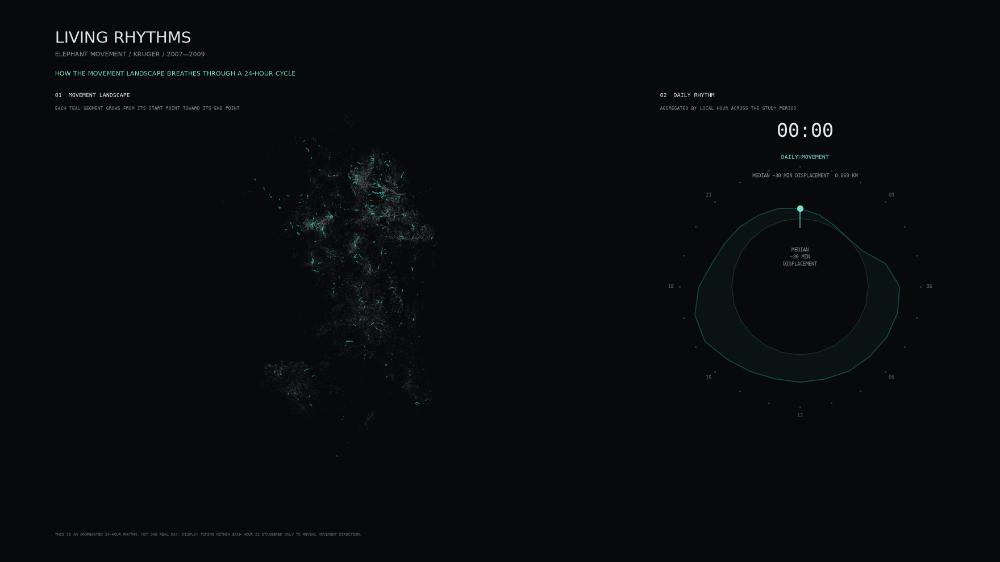
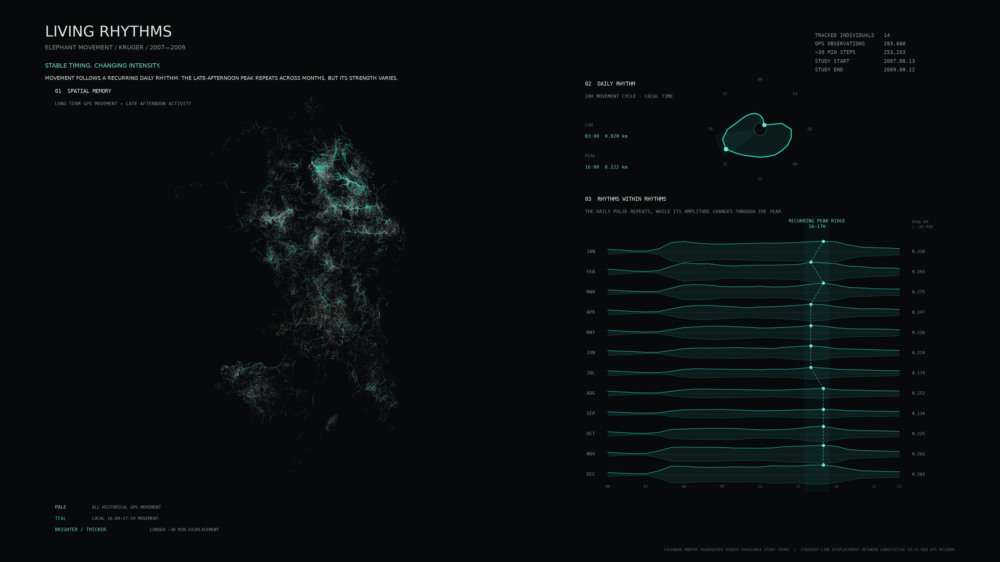

# Living Rhythms

### Animated 24-hour Movement Rhythm



### Static Analytical Summary



## The phenomenon

*Living Rhythms* explores the daily movement rhythm of tracked African elephants in Kruger National Park, South Africa. Rather than treating GPS records as isolated points, the project asks whether a larger temporal rhythm can emerge when many individual trajectories are viewed together.

## The source

The data comes from the Movebank dataset **ThermochronTracking Elephants Kruger 2007**.  
Source: [Movebank Data Repository](https://doi.org/10.5441/001/1.403h24q5)

The raw CSV contains **283,688 GPS observations from 14 tracked adult female African elephants**, collected between August 2007 and August 2009. Each row represents one GPS observation including timestamp, longitude, latitude, individual identifier, and external temperature. Location is recorded in geographic coordinates, temperature in °C, and calculated movement displacement in kilometres.

## What the picture shows

The animated visual shows an aggregated 24-hour movement rhythm across the full study period rather than one real calendar day. Movement is lowest before dawn and increases through the day, reaching its highest values around 16:00–17:00.

The static analytical summary shows the same dataset at multiple temporal scales. It combines the long-term movement landscape with the 24-hour daily rhythm and hourly rhythms across calendar months. The daily peak timing remains relatively stable across months, while its intensity changes. This leads to the main finding: **Stable timing, changing intensity.**

Movement is calculated as Haversine straight-line displacement between consecutive GPS records 29–31 minutes apart, producing **253,203 valid movement steps**. It therefore does not represent the exact walking distance travelled. The 24-hour animation is also an aggregated pattern rather than one real day, and the visualisation shows movement patterns rather than ecological causes.

## Interactive exploration

As an additional extension, `interactive.html` turns the fixed visualisation into a Macro-to-Micro exploration. The viewer can observe the **Macro collective rhythm**, zoom into the **Meso individual structure**, and hover over trajectories to reveal **Micro individual trajectories**.

## Run it

```bash
uv run animate_rhythm.py
```

### Optional outputs

Static analytical figure:

```bash
uv run tracking_landscape_v5.py
```

Interactive exploration:

```bash
uv run prepare_interactive.py
uv run python -m http.server 8000
```

Then open:

`http://localhost:8000/interactive.html`